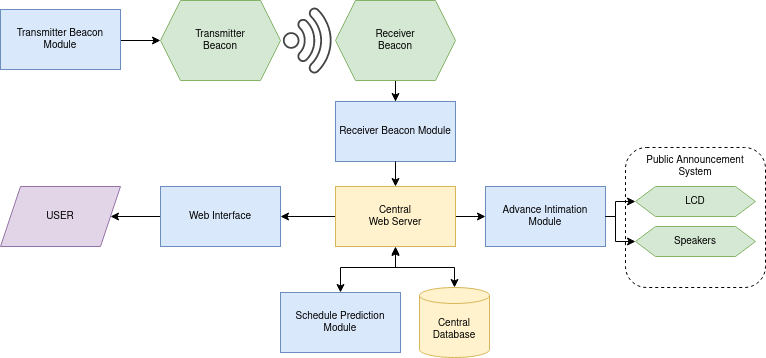
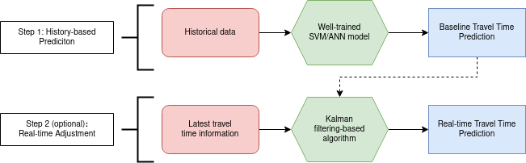
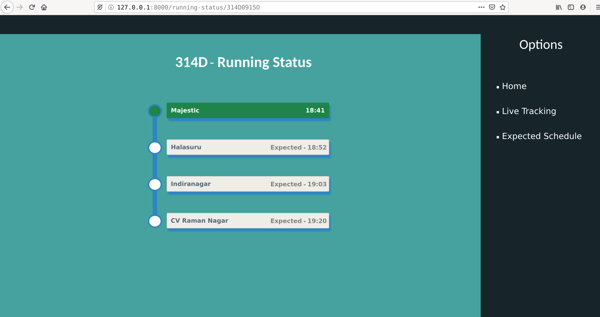
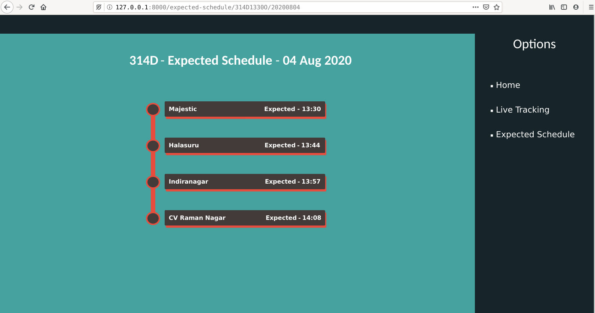
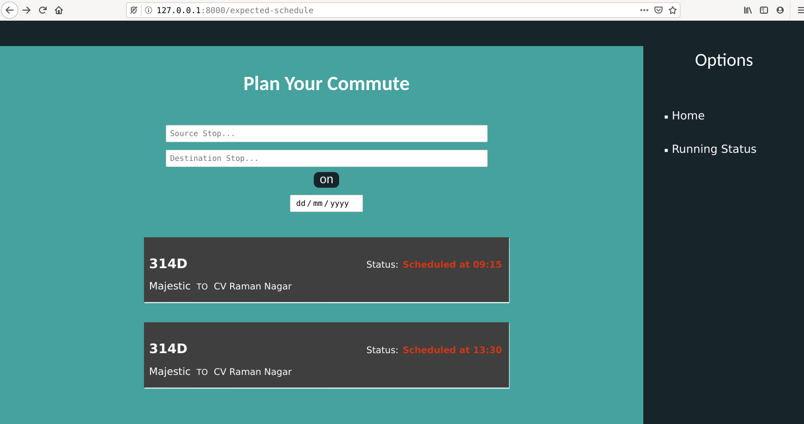

# LocateMyBus: IoT-driven Smart Bus Transit

> This project was funded by the [Research Center](https://www.ssn.edu.in/research-centre-ssn-institutions/) at [Sri Sivasubramaniya Nadar College of Engineering (SSNCE), TN, India](https://www.ssn.edu.in/) and carried out in collaboration with the [Computer Science Department at SSNCE](https://www.ssn.edu.in/college-of-engineering/computer-science-and-engineering-department-ssn-institutions/).

- Internet of Things (IoT) and Machine Learning (ML) to assuage the uncertainty in city bus schedules. 
- Allows commuters to track live running status and avail tentative schedule of buses. 
- Live running status for buses in transit; estimated schedule for planned future transits. 
- IoT architecture to log and track bus arrivals using RF-based short-range communication beacons.
- Central web-backend to synchronize arrival logs and publish schedule predictions using ML.

## Quick Links

- [Project Completion Report [PDF Slides]](./docs/completion-report_slides.pdf).
- [Research Funding Proposal [PDF Slides]](./docs/research-proposal_slides.pdf).

## Cite Us

[Link to the Research Paper](https://jcoms.fesb.unist.hr/pdfs/v19n2_2022-0143_Desingu.pdf).

If you find our work useful in your research, cite us.    
`BibTeX`:
```
@article{desingu2023locatemybus,
  author   = {Karthik Desingu and Daniel Mark Isaac and Mirunalini P. and Bharathi B. and Cherry Mathew Philipose},
  title    = {LocateMyBus: IoT-Driven Smart Bus Transit},
  journal  = {Journal of Communications Software and Systems},
  month    = {4},
  year     = {2023},
  volume   = {19},
  number   = {2},
  pages    = {136--146},
  doi      = {10.24138/jcomss-2022-0143},
  url      = {https://doi.org/10.24138/jcomss-2022-0143}
}
```

## System Architecture



## Schedule Prediction Workflow



## Web Interface

Web-based user interface for live-tracking and expected schedule display. 

- **Track live running status**: Viewer interface to access the current running status of in-transit buses, accurate to the granularity of bus stops.
    
  
  
- **Schedule prediction**: Interface to display the estimated schedule of buses on a given future date, predicted by the proposed machine learning algorithm that incorporates dynamic day-specific factors with historical data.   
   
  

- **Search for buses between stops**: Interface to inquire buses and schedules between two stops.  
   
  

> [!Note]
> This work is part of an ongoing research project. Hence, some portions of the implementation code have not been made public through this repository. This will be pushed post project completion.
